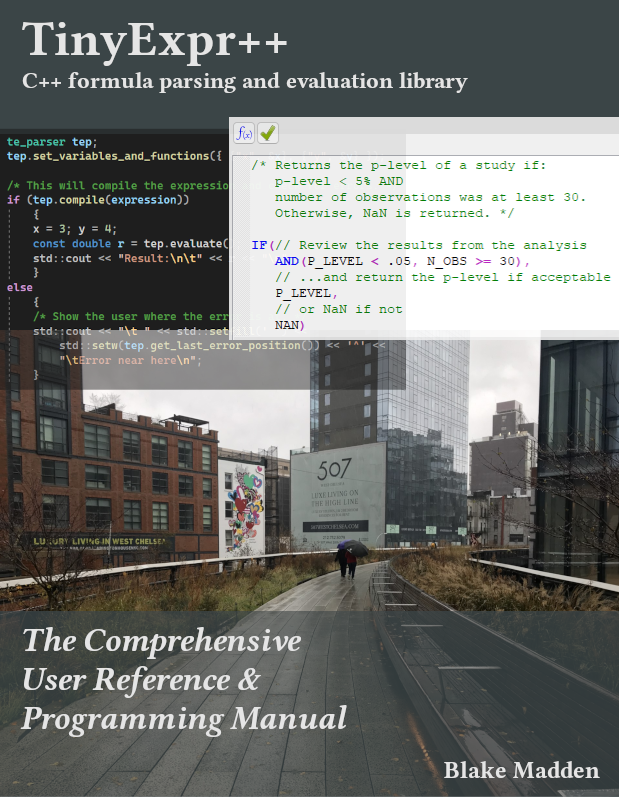

# TinyExpr++

<a href="docs/TinyExpr++ReferenceManual.pdf"></a>

*TinyExpr++* is the C++ version of the [*TinyExpr*](https://github.com/codeplea/tinyexpr) library, which is a small
recursive-descent parser and evaluation engine for math expressions.

In addition to math operators and precedence, *TinyExpr++* also supports
the standard C math functions and runtime binding of variables and user-defined functions.

Please refer to the [TinyExpr++ Reference Manual](docs/TinyExpr++ReferenceManual.pdf)
for a full list of features.

| Platforms  | Result |
| ------------- | ------------- |
| Linux  | [](https://github.com/Blake-Madden/tinyexpr-plusplus/actions/workflows/unit-tests.yml)  |
| macOS  | [](https://github.com/Blake-Madden/tinyexpr-plusplus/actions/workflows/macos-unit-tests.yml)  |
| Windows | [](https://github.com/Blake-Madden/tinyexpr-plusplus/actions/workflows/msw-unit-tests.yml) |


| Code Analyses  | Result |
| ------------- | ------------- |
| cppcheck | [](https://github.com/Blake-Madden/tinyexpr-plusplus/actions/workflows/cppcheck.yml) |
| MS PREfast | [](https://github.com/Blake-Madden/tinyexpr-plusplus/actions/workflows/msvc.yml) |
| CodeQL | [](https://github.com/Blake-Madden/tinyexpr-plusplus/actions/workflows/codeql.yml) |
| i18n-check | [](https://github.com/Blake-Madden/tinyexpr-plusplus/actions/workflows/i18n-check.yml) |


| Documentation Checks  | Result |
| ------------- | ------------- |
| Doxygen | [](https://github.com/Blake-Madden/tinyexpr-plusplus/actions/workflows/doxygen.yml) |
| Spellcheck | [](https://github.com/Blake-Madden/i18n-check/actions/workflows/spell-check.yml) |

## Compatibility Advisory

Note: for current users of *TinyExpr++*, please see the [compatibility advisory](CompatibilityAdvisory.md) for recent changes.

## Embedded Programming

For notes on embedded programming, please refer to the [embedded programming](Embedded.md) overview.

## Features

- **C++17 with no dependencies**.
- Single source file and header file.
- Simple and fast.
- Implements standard operator precedence.
- Implements logical and comparison operators.
- Exposes standard C math functions (`sin`, `sqrt`, `ln`, etc.), as well as some *Excel*-like functions (e.g., `AVERAGE()` and `IF()`).
- Can add custom functions and variables easily.
- Can bind constants at eval-time.
- Supports variadic functions (taking between 1-7 arguments).
- Case insensitive.
- Supports non-US formulas (e.g., `POW(2,2; 2)` instead of `POW(2.2, 2)`).
- Supports C and C++ style comments within math expressions.
- Released under the zlib license - free for nearly any use.
- Easy to use and integrate with your code.
- Thread-safe; parser is in a self-contained object.

## Changes from TinyExpr

Please refer [here](TinyExprChanges.md) for a list of changes from the original *TinyExpr* C library.

## Building

*TinyExpr++* is self-contained in two files: "tinyexpr.cpp and "tinyexpr.h". To use
*TinyExpr++*, simply add those two files to your project.

The documentation can be built using the following:

```
doxygen docs/Doxyfile
```

## Short Example

Here is a minimal example to evaluate an expression at runtime.

```cpp
#include "tinyexpr.h"
#include <iostream>
#include <iomanip>
#include <string>

te_parser tep;

const double r = tep.evaluate("sqrt(5^2+7^2+11^2+(8-2)^2)");
std::cout << std::setprecision(8) << "The expression:\n\t" <<
    tep.get_expression() << "\nevaluates to:\n\t" <<
    r << "\n";
// prints 15.198684
```

## Usage

*TinyExpr++*'s `te_parser` class defines these functions:

```cpp
double evaluate(const std::string_view expression);
double get_result();
bool success();
int64_t get_last_error_position();
std::string get_last_error_message();
set_variables_and_functions(const std::set<te_variable>& vars);
std::set<te_variable>& get_variables_and_functions();
add_variable_or_function(const te_variable& var);
set_unknown_symbol_resolver(te_usr_variant_type usr);
get_decimal_separator();
set_decimal_separator();
get_list_separator();
set_list_separator();
```

`evaluate()` takes an expression and immediately returns the result of it. If there
is a parse error, then it returns NaN (which can be verified by using `std::isnan()`).

`get_result()` can be called anytime afterwards to retrieve the result from `evaluate()`.

`success()` can be called to see if the previous call `evaluate()` succeeded or not.

If the parse failed, calling `get_last_error_position()` will return the 0-based index of where in the
expression the parse failed. For some errors, `get_last_error_message()` will return a more detailed message.

`set_variables_and_functions()`, `get_variables_and_functions()`, and `add_variable_or_function()` are used
to add custom variables and functions to the parser.

`set_unknown_symbol_resolver()` is used to provide a custom function to resolve unknown symbols in an expression.

`get_decimal_separator()`/`set_decimal_separator()` and
`get_list_separator()`/`set_list_separator()` can be used to parse non-US formatted formulas.

Example usage:

```cpp
te_parser tep;

// Returns 10, error position is set to te_parser::npos (i.e., no error).
double result = tep.evaluate("(5+5)");
// Returns NaN, error position is set to 3.
double result2 = tep.evaluate("(5+5");
```

Give `set_variables_and_functions()` a list of constants, bound variables, and function pointers/lambdas.

`evaluate()` will then evaluate expressions using these variables and functions.

**example usage:**

```cpp
#include "tinyexpr.h"
#include <iostream>

double x{ 0 }, y{ 0 };
// Store variable names and pointers.
te_parser tep;
tep.set_variables_and_functions({{"x", &x}, {"y", &y}});

// Compile the expression with variables.
auto result = tep.evaluate("sqrt(x^2+y^2)");

if (tep.success())
    {
    x = 3; y = 4;
    // Will use the previously used expression, returns 5.
    const double h1 = tep.evaluate();

    x = 5; y = 12;
    // Returns 13.
    const double h2 = tep.evaluate();
    }
else
    {
    std::cout << "Parse error at " <<
        std::to_string(tep.get_last_error_position()) << "\n";
    }
```

## Longer Example

Here is a complete example that will evaluate an expression passed in from the command
line. It also does error checking and binds the variables `x` and `y` to `3` and `4`, respectively.

```cpp
#include "tinyexpr.h"
#include <iostream>
#include <iomanip>

int main(int argc, char *argv[])
    {
    if (argc < 2)
        {
        std::cout << "Usage: example \"expression\"\n";
        return EXIT_FAILURE;
        }

    const char *expression = argv[1];
    std::cout << "Evaluating:\n\t" << expression << "\n";

    /* This shows an example where the variables
       x and y are bound at eval-time. */
    double x{ 0 }, y{ 0 };
    // Store variable names and pointers.
    te_parser tep;
    tep.set_variables_and_functions({{"x", &x}, {"y", &y}});

    /* This will compile the expression and check for errors. */
    auto result = tep.evaluate(expression);

    if (tep.success())
        {
        /* The variables can be changed here, and eval can be called as many
           times as you like. This is fairly efficient because the parsing has
           already been done. */
        x = 3; y = 4;
        const double r = tep.evaluate();
        std::cout << "Result:\n\t" << r << "\n";
        }
    else
        {
        /* Show the user where the error is at. */
        std::cout << "\t " << std::setfill(' ') <<
            std::setw(tep.get_last_error_position()) << '^' <<
            "\tError near here\n";
        }

    return EXIT_SUCCESS;
    }
```

This produces the output:

    $ "sqrt(x^2+y2)"
       Evaluating:
            sqrt(x^2+y2)
                      ^
       Error near here

    $ "sqrt(x^2+y^2)"
      Evaluating:
            sqrt(x^2+y^2)
      Result:
            5.000000

## Binding to Custom Functions

*TinyExpr++* can also call custom functions. Here is a short example:

```cpp
double my_sum(double a, double b)
    {
    /* Example function that adds two numbers together. */
    return a + b;
    }

te_parser tep;
tep.set_variables_and_functions(
{
    { "mysum", my_sum } // function pointer
});

const double r = tep.evaluate("mysum(5, 6)");
// will be 11
```

Here is an example of using a lambda:

```cpp
te_parser tep;
tep.set_variables_and_functions({
    { "mysum",
        [](double a, double b) noexcept
            { return a + b; } }
    });

const double r = tep.evaluate("mysum(5, 6)");
// will be 11
```

## Binding to Custom Classes

A class derived from `te_expr` can be bound to custom functions. This enables you to
have full access to an object (via these functions) when parsing an expression.

The following demonstrates creating a `te_expr`-derived class which contains an array of values:

```cpp
class te_expr_array : public te_expr
    {
public:
    explicit te_expr_array(const te_variable_flags type) noexcept :
        te_expr(type) {}
    std::array<double, 5> m_data = { 5, 6, 7, 8, 9 };
    };
```

Next, create two functions that can accept this object and perform
actions on it. (Note that proper error handling is not included for brevity.):

```cpp
// Returns the value of a cell from the object's data.
double cell(const te_expr* context, double a)
    {
    auto* c = dynamic_cast<const te_expr_array*>(context);
    return static_cast<double>(c->m_data[static_cast<size_t>(a)]);
    }

// Returns the max value of the object's data.
double cell_max(const te_expr* context)
    {
    auto* c = dynamic_cast<const te_expr_array*>(context);
    return static_cast<double>(
        *std::max_element(c->m_data.cbegin(), c->m_data.cend()));
    }
```

Finally, create an instance of the class and connect the custom functions to it,
while also adding them to the parser:

```cpp
te_expr_array teArray{ TE_DEFAULT };

te_parser tep;
tep.set_variables_and_functions(
    {
        {"cell", cell, TE_DEFAULT, &teArray},
        {"cellmax", cell_max, TE_DEFAULT, &teArray}
    });

// change the object's data and evaluate their summation
// (will be 30)
teArray.m_data = { 6, 7, 8, 5, 4 };
auto result = tep.evaluate("SUM(CELL 0, CELL 1, CELL 2, CELL 3, CELL 4)");

// call the other function, getting the object's max value
// (will be 8)
res = tep.evaluate("CellMax()");
```

## Non-US Formatted Formulas

*TinyExpr++* supports other locales and non-US formatted formulas. Here is an example:

```cpp
#include "tinyexpr.h"
#include <iostream>
#include <iomanip>
#include <locale>
#include <clocale>

int main(int argc, char *argv[])
    {
    /* Set locale to German.
       This string is platform dependent. The following works on Windows,
       consult your platform's documentation for more details.*/
    setlocale(LC_ALL, "de-DE");
    std::locale::global(std::locale("de-DE"));

    /* After setting your locale to German, functions like strtod() will fail
       with values like "3.14" because it expects "3,14" instead.
       To fix this, we will tell the parser to use "," as the decimal separator
       and ";" as list argument separator.*/

    const char *expression = "pow(2,2; 2)"; // instead of "pow(2.2, 2)"
    std::cout << "Evaluating:\n\t" << expression << "\n";

    te_parser tep;
    tep.set_decimal_separator(',');
    tep.set_list_separator(';');

    /* This will compile the expression and check for errors. */
    auto r = tep.evaluate(expression);

    if (tep.success())
        {
        const double r = tep.evaluate(expression);
        std::cout << "Result:\n\t" << r << "\n";
        }
    else
        {
        /* Show the user where the error is at. */
        std::cout << "\t " << std::setfill(' ') <<
            std::setw(tep.get_last_error_position()) << '^' <<
            "\tError near here\n";
        }

    return EXIT_SUCCESS;
    }
```

This produces the output:

    $ Evaluating:
        pow(2,2; 2)
      Result:
        4,840000

Refer to [Examples](Examples.md) for more examples.

## How it Works

`te_parser::evaluate()` uses a simple recursive descent parser to compile your
expression into a syntax tree. For example, the expression `"sin x + 1/4"`
parses as:


`te_parser::evaluate()` also automatically prunes constant branches. In this example,
the compiled expression returned by `te_compile()` would become:


## Grammar

*TinyExpr++* parses the following grammar (from lowest-to-highest operator precedence):

    <list>      =    <expr> {(",", ";" [dependent on locale]) <expr>}
    <expr>      =    <term> {("&" | "|") <term>}
    <expr>      =    <term> {("<>" | "!=" | "=" | "<") | "<=") | ">" | ">=") <term>}
    <expr>      =    <term> {("<<" | ">>") <term>}
    <expr>      =    <term> {("+" | "-") <term>}
    <term>      =    <factor> {("*" | "/" | "%") <factor>}
    <factor>    =    <power> {("^" | "**") <power>}
    <power>     =    {("-" | "+")} <base>
    <base>      =    <constant>
                   | <variable>
                   | <function-0> {"(" ")"}
                   | <function-1> <power>
                   | <function-X> "(" <expr> {"," <expr>} ")"
                   | "(" <list> ")"

In addition, whitespace between tokens is ignored.

Valid variable names consist of a letter or underscore followed by any combination
of: letters `a`–`z` or `A`–`Z`, digits `0`–`9`, periods, and
underscores. Constants can be integers, decimal numbers, or in scientific
notation (e.g., `1e3` for `1000`). A leading zero is not required (e.g., `.5`
for `0.5`).

## Supported Functions

*TinyExpr++* supports addition (`+`), subtraction/negation (`-`), multiplication (`*`),
division (`/`), exponentiation (`^`), modulus (`%`), and left/right shift (`<<`, `>>`)
with the normal operator precedence (the one exception being that exponentiation is evaluated
left-to-right, but this can be changed - see below).

Please refer to the [TinyExpr++ Reference Manual](docs/TinyExpr++ReferenceManual.pdf)
for a full list of available functions.
